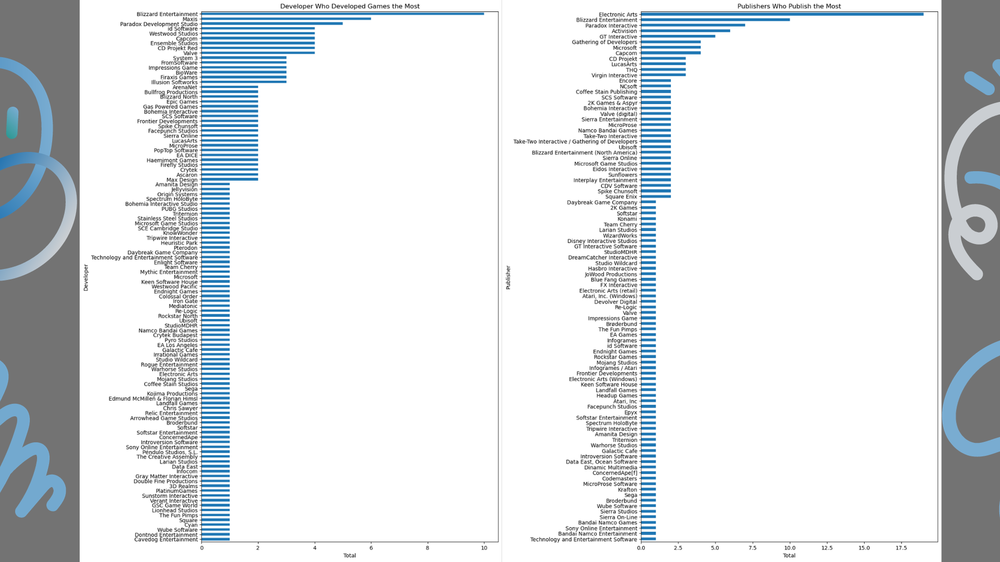

# Games Sales - Data Analysis Portfolio Project - RevoU Study Case

## Project Overview
During the mini-course held by RevoU, I gained a lot of knowledge about data analysis, including analyzing data using Python. 
RevoU provides a Study Case that can be done in the mini-course as an exercise in analyzing data. 
The purpose of this project is to analyze datasets in the Gaming Industry. 



There are also things to know when analyzing this game sales dataset such as: 
1.	Which games are the newest and oldest in the dataset?
2.	Which publisher publishes the most games?
3.	Which developers develop the most games?
4.	Which series sells the most games?
5.	Which series has the most games?
   
## Data Source
Games Sales: The dataset used for this analysis is the "Games Sales - Case Study.xlsx", containing information about games sales.
- [Download File Source Here](https://github.com/HilmaSabela/GamesSales_RevoUProject/blob/main/Games%20Sales%20-%20Case%20Study.xlsx)

## Tool
In this project, Python is used to clean, transform, and analyze the dataset.

Include some Python libraries worked with
``` python
import pandas as pd
import numpy as np
import matplotlib.pyplot as plt
import datetime as date
```

### The steps of analyzing data
1. Data Preparation and Inspection
2. Data Cleaning and Transforming
3. EDA (Exploratory Data Analysis): Exploring game sales data to answer key questions.


### Result
Based on the analysis of game sales, the results are summarized as follows:
- The oldest game is Hydlide which was released in 1984, while the youngest game is Valheim which was released in 2021. 
- Electronic Art is the Publisher with the highest number of game publications with 19.
- Blizzard Entertainment is the biggest developer of game developed 10 games.
- The game series with the most sales is Minecraft with 33.
- The series with the most games is StarCraft with 6 games.

## Limitation
- From the data frame information there are NaN values in the Series column. 
However, I didn't delete it because the rows of data that contain NaN values are also very important to analyze.
- The data frame is clean enough, so I only remove duplicate data.

